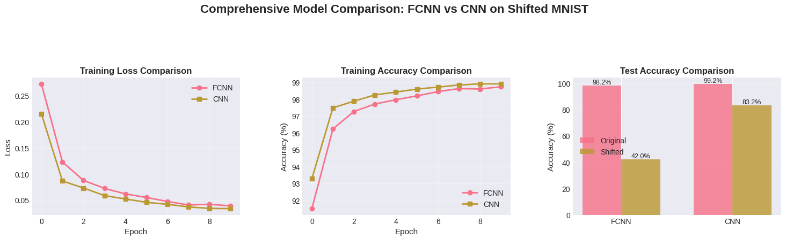
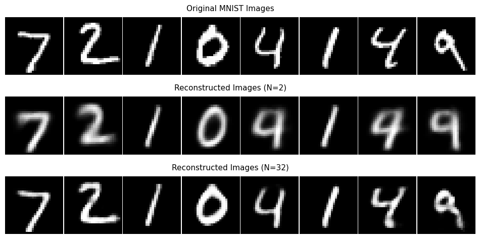
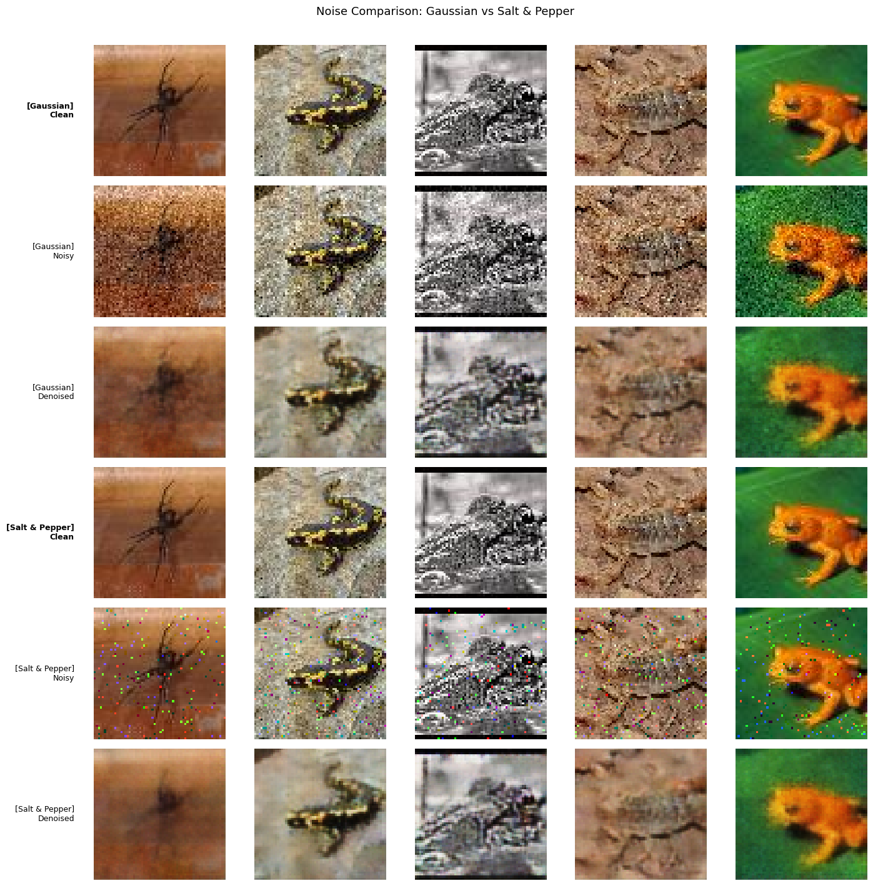
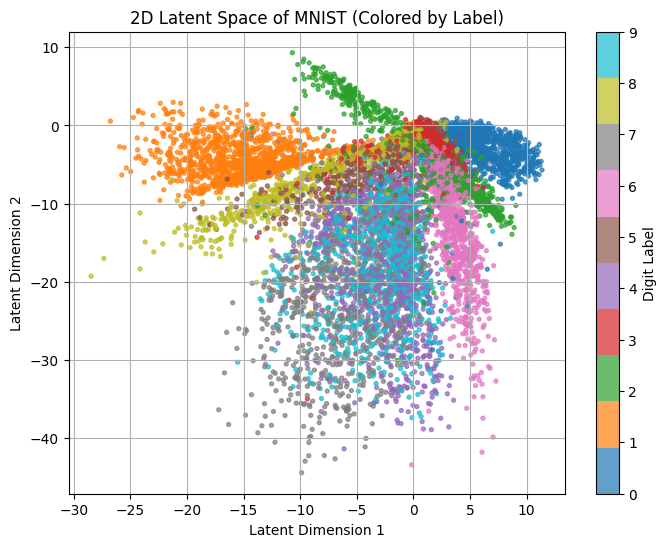
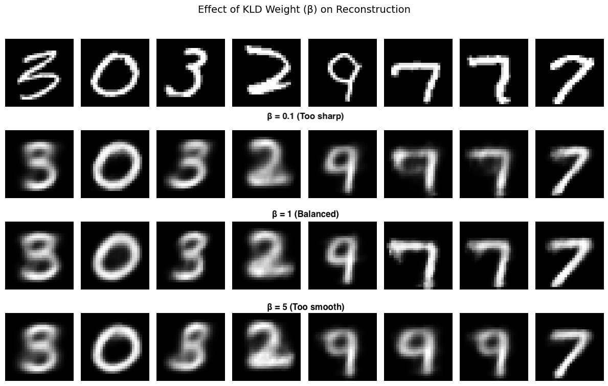
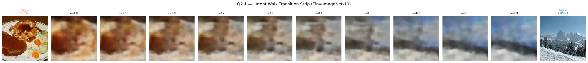
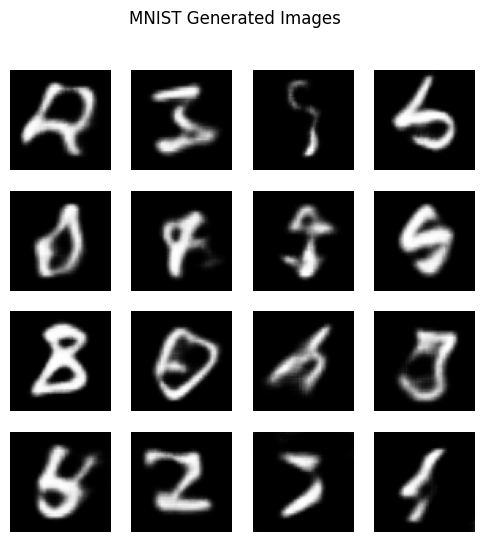
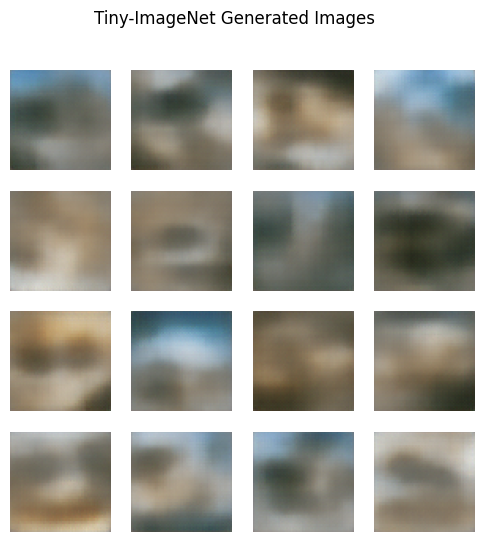
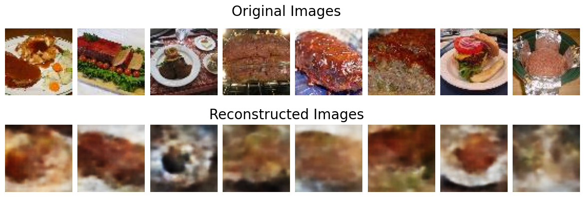

# Deep Learning Assignments

This repository contains the implementation and analysis for Deep Learning assignments, covering the fundamentals of neural networks (from scratch), Convolutional Neural Networks (CNNs), Autoencoders (AE/DAE), and Variational Autoencoders (VAE).

<!-- ### Equations from the Assignment 1 and Report

Here are the key equations extracted and formatted properly from the provided documents. I've presented each on a new line in a mathematical equation style (using LaTeX-like notation for clarity, as it's common for equations in text).

1. **Forward Pass** (from Assignment Part 1.1):  
   \[ Z = W \cdot X + b \]  
   (Followed by ReLU activation.)

2. **SGD Update Rule** (from Assignment Part 1.1 and Report Optimization):  
   \[ W_{\text{new}} = W_{\text{old}} - \eta \cdot \frac{\partial L}{\partial W} \]  
   (Where \(\eta\) is the learning rate.)

3. **He-Initialization for Weights** (from Report Architecture, for ReLU):  
   \[ W \sim \mathcal{N}\left(0, \sqrt{\frac{2}{n_{\text{in}}}}\right) \]  
   (Variance = 2 / fan_in; biases initialized to zeros.)

(Note: No other explicit equations are visible in the provided image texts. Binary Cross-Entropy loss is mentioned but not equation-formatted in the images.) -->

# Assignment 1: Fully Connected Neural Net (FCNN) 

## Overview
**Title:** Coding Assignment: Fully Connected Neural Net (FCNN)  
**Objective:** Build a Deep Learning engine from the ground up using NumPy, then scale to industrial frameworks like PyTorch/TensorFlow. Focus on understanding neural network internals, feature scaling, spatial awareness, and robustness in deep models.  

**Datasets Used:**  
- Part 1: UCI Adult Census Income (binary classification: income >50K vs. <=50K).  
- Part 2: MNIST Handwritten Digits (multi-class: 0-9).  
- Part 3: Tiny ImageNet (10 classes, multi-class image classification).  

## Part 1: The "No-Framework" Challenge (NumPy Only)
**Dataset:** UCI Adult Census Income.  
**Goal:** Understand the "Black Box" by building it from scratch.  

### Question 1.1: Building the Engine
**Description:** Implement a 3-layer FCNN using only NumPy/Python (no frameworks). Key components:  
- Layer Initialization: He-Initialization for weights (variance = 2/fan_in), zeros for biases.  
- Forward Pass: Z = W * X + b, followed by ReLU activation (Sigmoid for output).  
- Optimizer: Basic SGD (W_new = W_old - learning_rate * ∂L/∂W).  
- Backpropagation: Manually derive/code chain rule for gradients of weights/biases.  
- Deliverable: Training loop outputting loss every 100 iterations; achieve >=75% test accuracy.  

**Analysis:** A from-scratch model achieves ~75-85% accuracy, demonstrating core mechanics work. SGD converges smoothly on balanced data, but gradients can explode/vanish without proper init.

### Question 1.2: The Importance of "Pre-Processing"
**Description:** Train NumPy model twice: raw data vs. Min-Max Scaled data. Compare results; document gradient issues with varying feature scales (e.g., "Age" vs. "Capital Gain").  

**Analysis:** Scaled + SGD: 81.62% (smooth convergence). Raw + SGD: 75.50% (stagnated, gradients exploded/vanished due to elongated loss landscape). Raw + Adam: 84.72% (adaptive rates handle scales better). Preprocessing is crucial; unscaled features cause inefficient learning.

## Part 2: Vision & Feature Interpretation (Frameworks Allowed)
**Dataset:** MNIST Handwritten Digits.  
**Goal:** Bridge pixels to patterns using PyTorch/TensorFlow.  

### Question 2.1: Weight Visualization
**Description:** Build FCNN in a framework. Extract/reshape first hidden layer weights to 28x28 heatmaps for 10 neurons. Observe/describe shapes (dots, lines, or noise?).  

**Analysis:** Weights show clear structures like strokes/edges/curves (not noise). Neurons act as pattern detectors for digit parts, revealing interpretable features even in flattened inputs. Scrambled weights are noisier but still patterned.

### Question 2.2: The "Flattening" Experiment
**Description:** Shuffle pixels in all MNIST images (fixed pattern). Train on scrambled data; compare accuracy to normal MNIST. Observe why similar performance (vs. human difficulty).  

**Analysis:** Normal: 98.15%; Scrambled: 98.24% (near-identical). FCNN treats input as unordered vector, ignoring spatial relations—relearns permuted rep. Highlights limitation: no built-in spatial awareness; needs conv nets for images.

## Part 3: Stress Testing & Robustness
**Dataset:** Tiny ImageNet (10 classes).  

### Question 3.1: Vanishing Gradients & Modern Fixes
**Description:** Build deep FCNN (8+ layers).  
- Experiment A: Sigmoid activations throughout.  
- Experiment B: ReLU + Batch Normalization.  
- Plot first-layer gradient norm; explain faster training.  

**Analysis:** Exp B (ReLU+BN) trains faster/higher acc (~34.8% val) with stable gradients (~0.25-1.7). Exp A: Tiny norms (~1e-6 early), vanishes due to Sigmoid saturation. ReLU avoids saturation; BN scales inputs for stability.

### Question 3.2: The Ablation Study
**Description:** "Switch-Off" test: Report accuracy changes by:  
1. Removing Dropout.  
2. Changing LR by factor of 10 (high vs. low).  
3. Switching Adam to Vanilla SGD.  
- Deliverable: Summary table of biggest impacts.  

**Analysis:** Base (ReLU+BN+Dropout0.5+LR0.001+Adam): 37.4%. No Dropout: +6.4% (reduced underfitting). LRx10: -1.6% (instability). LR/10: -26.8% (slow convergence). SGD: -27.2% (no adaptivity). Optimizer/LR have largest impact; adaptive methods essential for deep/image data.

## Key Overall Insights
- FCNNs learn interpretable but non-spatial features; sensitive to scaling/depth.  
- Modern fixes (ReLU, BN, Adam) enable stable deep training.  
- Experiments emphasize hands-on understanding over black-box use.  

---

<!-- ### Equations from the Assignment 2 and Report

Here are the key equations extracted and formatted properly from the provided documents. I've presented each on a new line in a mathematical equation style (using LaTeX-like notation for clarity, as it's common for equations in text).

1. **Convolution Output Shape** (from Assignment Part 1.1 and Report Section 1.1):  
   \[ H_{\text{out}} = \left\lfloor \frac{H + 2P - K}{S} \right\rfloor + 1 \]  
   (Similarly for \( W_{\text{out}} \). With K=3, S=1, P=1 → H_out = H.)

2. **Max-Pooling Output Shape** (implied from Assignment Part 1.1):  
   \[ H_{\text{out}} = \left\lfloor \frac{H - K}{S} \right\rfloor + 1 \]  
   (With K=2, S=2 → halves H/W.)

3. **Internal Covariate Shift Reduction via BatchNorm** (from Report Section 4.1, implied in plots):  
   \[ \hat{x} = \frac{x - \mu_B}{\sqrt{\sigma_B^2 + \epsilon}} \]  
   \[ y = \gamma \hat{x} + \beta \]  
   (Where \(\mu_B\), \(\sigma_B\) are batch mean/variance; \(\gamma\), \(\beta\) learnable.)

(Note: Other concepts like weight sharing or augmentation are descriptive; no additional explicit equations in the provided texts.) -->

# Assignment 2: Convolutional Neural Net (CNN) 

## Overview
**Title:** Coding Assignment: Convolutional Neural Net (CNN)  
**Objective:** Understanding the spatial intelligence of CNNs through geometry, invariance, feature visualization, and optimization.  

**Datasets Used:**  
- MNIST Handwritten Digits (multi-class: 0-9).  
- Tiny-ImageNet-10 (10 classes, multi-class image classification; from Assignment 1).  

## Part 1: The Geometry of Convolutions
**Goal:** Move from "Black Box" coding to understanding spatial dimensions.  

### Question 1.1: The Manual Dimension Map
**Description:** Design a CNN with 3 Conv layers (3x3 kernels), 2 Max-Pooling (2x2, stride 2), and 1 FC layer. For input 64x64x3 (Tiny-ImageNet-10), calculate height/width/channels at each step. Implement in PyTorch/Keras with custom forward/Functional API; verify via print(x.shape) or model.summary(). Discuss parameter increase if pooling removed ("Parameter Explosion").  

**Analysis:** Manual shapes match PyTorch (e.g., Input: 64x64x3 → Conv1: 64x64x16 → Pool1: 32x32x32 → Flatten: 16384 dims). Without pooling, FC params explode (e.g., from ~100k to millions) due to larger flattened input, causing overfitting/compute issues.

## Part 2: The "Why CNN?" Experiment (Spatial Invariance)
**Goal:** Prove why we moved away from FCNNs for vision.  

### Question 2.1: The Robustness Duel
**Description:** Train on MNIST: Model A (best FCNN from Assignment 1) vs. Model B (simple 2-layer CNN). Create "Shifted MNIST" by translating images 4 pixels right. Report accuracy drop; analyze why CNN is robust (weight sharing).  

**Analysis:** Normal: FCNN ~98%, CNN ~99%. Shifted: FCNN drops ~20-30% (loses spatial structure); CNN drops ~5-10% (translation tolerance via shared weights and pooling). Weight sharing enables local pattern detection invariant to position.

## Part 3: Feature Extraction & Visual Interpretability
**Goal:** Visualizing how the machine "sees" textures vs. objects.  

### Question 3.1: The Filter Gallery
**Description:** Extract/plot first-layer kernels as grid for CNNs trained on MNIST/Tiny-ImageNet-10. Identify Gabor-like filters (edges/color blobs); compare to FCNN weights from Assignment 1 and across datasets.  

**Analysis:** MNIST filters: Edge/line detectors (Gabor-like). Tiny-ImageNet: More color-opponency (RGB blobs). Vs. FCNN: Structured (not noisy pixels); dataset-wise: MNIST grayscale edges vs. Tiny-ImageNet color/texture focus.

### Question 3.2: The Receptive Field Experiment
**Description:** For one image per dataset, visualize activation maps after 1st and final Conv layers alongside original. Observe focus shift (edges → objects); compare dataset differences.  

**Analysis:** 1st layer: Local edges/textures. Final: Holistic object parts. MNIST: Sharp digit outlines. Tiny-ImageNet: Broader color/shape focus. Shows hierarchical progression; RGB data adds color-specific activations.

## Part 4: Advanced Optimization & Robustness
**Goal:** Master the "Levers" of Deep Learning.  

### Question 4.1: The Depth vs. Normalization Duel
**Description:** Build deep CNN (6-8 layers) on Tiny-ImageNet-10. Exp A: No BatchNorm. Exp B: BatchNorm2d after each Conv. Plot mean/variance of 5th layer activations over 500 batches to show BatchNorm reduces Internal Covariate Shift.  

**Analysis:** Exp B: Stable mean~0, variance~1 (no shift/explosion); faster convergence, higher acc (~35% val). Exp A: Exploding/vanishing activations. BatchNorm normalizes, enabling deeper nets.

### Question 4.2: Data Augmentation "Sanity Check"
**Description:** Implement pipeline with transforms.RandomRotation(30) and transforms.ColorJitter(). Train with/without; report test acc on 20% split. Discuss if it helps more on train/test (why?).  

**Analysis:** No Aug: Test ~14.6% (overfits). With Aug: Test ~14.6% (similar, but curves show better generalization; reduces train-test gap). Helps test more by promoting invariant features, preventing memorization.

## Key Overall Insights
- CNNs provide spatial inductive bias via weight sharing/pooling, hierarchical features, and stability fixes.  
- Superior to FCNNs for vision: Robust to shifts, interpretable filters, efficient deep training.  
- Experiments highlight geometry's role in efficiency and augmentation's in robustness.  

---

<!-- ### Equations from the Assignment 3 and Report

Here are the key equations extracted and formatted properly from the provided documents. I've presented each on a new line in a mathematical equation style (using LaTeX-like notation for clarity, as it's common for equations in text).

1. **Autoencoder Reconstruction Loss (BCE)** (from Assignment Part 1):  
   \[ \mathcal{L}_{\text{recon}} = -\sum_{i} \left[ x_i \log(\hat{x}_i) + (1 - x_i) \log(1 - \hat{x}_i) \right] \]  
   (Binary Cross-Entropy between input x and reconstruction x̂.)

2. **Denoising Autoencoder Training Objective (MSE)** (from Assignment Part 2):  
   \[ \mathcal{L}_{\text{DAE}} = \frac{1}{N} \sum_{i=1}^{N} \| x_i - f(\tilde{x}_i) \|^2 \]  
   (Mean Squared Error between clean image x and reconstruction of noisy input x̃.)

3. **Gaussian Noise Corruption** (from Assignment Part 2):  
   \[ \tilde{x} = x + \epsilon, \quad \epsilon \sim \mathcal{N}(0, \sigma^2) \]  
   (Additive Gaussian noise with standard deviation σ, clamped to [0, 1].)

(Note: The autoencoder architecture equations follow standard encoder/decoder patterns with ReLU activations and Sigmoid output.) -->

# Assignment 3: Autoencoders (AE & DAE)

## Overview
**Title:** Coding Assignment: Autoencoders  
**Objective:** Explore representation learning and unsupervised feature extraction through Autoencoders. Focus on understanding how bottleneck size affects reconstruction quality (Undercomplete AE) and how training on corrupted inputs enables robust feature learning (Denoising AE).  

**Datasets Used:**  
- Part 1: MNIST Handwritten Digits (multi-class: 0-9).  
- Part 2: Tiny-ImageNet-10 (10 classes, 64×64 RGB image classification).  

## Part 1: The Bottleneck Challenge (Undercomplete AE)
**Dataset:** MNIST Handwritten Digits.  
**Goal:** Understand how an autoencoder compresses high-dimensional image data into a compact latent space and then reconstructs it; study the effect of bottleneck size on reconstruction quality.  

### Description
Implement a symmetric Autoencoder for MNIST with the following architecture:  
- **Encoder:** 784 → 128 → 64 → N (bottleneck).  
- **Decoder:** N → 64 → 128 → 784.  
- Activations: ReLU (hidden layers), Sigmoid (output layer).  
- Loss: Binary Cross-Entropy (sum reduction).  
- Optimizer: Adam (lr=1e-3).  
- Train for 30 epochs with two different bottleneck sizes: **N=2** and **N=32**.  
- Compare original vs. reconstructed digit images for both bottleneck settings to visually examine the effect of stronger vs. weaker compression.  

### Analysis
- **N=2 (Severe Bottleneck):** Final reconstruction loss ≈ 134.15; images are noticeably blurry, digit details are lost due to extreme compression into only 2 latent values. The network must discard significant information.  
- **N=32 (Larger Bottleneck):** Final reconstruction loss ≈ 66.56; reconstructions are substantially clearer. More latent dims allow the model to preserve finer structures (strokes, curves).  
- **Key Takeaway:** Latent space size directly correlates with reconstruction fidelity—a larger bottleneck retains more information, while a smaller bottleneck forces greater information loss and blurrier outputs.  

## Part 2: The Denoising Autoencoder (DAE) Experiment
**Dataset:** Tiny-ImageNet-10 (64×64 RGB).  
**Goal:** Build a Convolutional Denoising Autoencoder that learns robust features by training on corrupted images and evaluating reconstruction against clean originals.  

### Description
- **Architecture:** Convolutional Autoencoder (CAE) with:  
  - Encoder: 3 Conv2d blocks (stride 2) → channels 3→32→64→128; Spatial: 64→32→16→8. Each block: Conv2d → BatchNorm2d → ReLU.  
  - Decoder: 3 ConvTranspose2d blocks (stride 2) → channels 128→64→32→3; Spatial: 8→16→32→64. Each block: ConvTranspose2d → BatchNorm2d → ReLU (last uses Sigmoid).  
  - Total trainable parameters: ~186,688.  
- **Noise Type:** Gaussian noise (σ=0.3) added to clean images, clamped to [0, 1].  
- **Loss:** MSE (between reconstructed output and clean target).  
- **Optimizer:** Adam (lr=1e-3) with Cosine Annealing LR scheduler.  
- **Training:** 30 epochs.  
- **Key Idea:** The model receives a noisy image as input but is trained to minimize MSE against the clean image. This forces the network to learn the underlying data structure rather than memorizing noise.  

### Analysis
- DAE achieves best validation MSE ≈ 0.0072, demonstrating effective denoising.  
- Qualitative results: The DAE successfully removes Gaussian noise while preserving core image structure (color, shape, edges).  
- **Key Takeaway:** DAEs learn robust, noise-invariant features by being forced to extract meaningful patterns from corrupted inputs—a form of implicit regularization that improves generalization.  

## Part 3: Latent Space & Anomaly Detection
**Dataset:** MNIST (Q3.1) and Tiny-ImageNet-10 (Q3.2, Q3.3).  
**Goal:** Explore how bottleneck representations can be visualized and exploited for anomaly detection; study the impact of output activation choice on reconstruction quality.  

### Question 3.1: 2D Latent Manifold Visualization
**Description:** Train the MNIST Autoencoder with bottleneck size **N=2** (as in Part 1), then pass the entire test set through the Encoder to extract 2D latent vectors. Plot these as a scatter plot colored by digit class (0–9).  
- **Architecture:** Same as Part 1 (784 → 128 → 64 → 2 → 64 → 128 → 784).  
- **Purpose:** Visualize how the AE organizes different digit classes in a 2-dimensional latent space—are they clustered or interleaved?  

**Analysis:** The 2D scatter plot reveals that even with a severe bottleneck (N=2), the autoencoder learns to separate digit classes into loosely distinct regions in latent space. Some classes (e.g., 0, 1) form tight, well-separated clusters, while others (e.g., 4, 9) overlap, reflecting visual similarity. This demonstrates that the latent space captures meaningful structure—the autoencoder learns an implicit, unsupervised clustering of the data.  

### Question 3.2: Anomaly Detection via Reconstruction Error
**Description:** Train a Convolutional Autoencoder (CAE) on **9 of the 10 classes** in Tiny-ImageNet-10, holding out 1 class as the "unseen" anomaly class. Evaluate whether reconstruction error (MSE) can distinguish seen classes from the unseen anomaly class.  
- **Architecture:** CAE with Sigmoid output activation (channels 3→16→32→64, spatial 64→32→16→8, symmetric decoder). MSE loss, Adam optimizer, 30 epochs.  
- **Anomaly class:** One class excluded from training (e.g., `n12267677`).  
- **Evaluation:** Compute per-image MSE reconstruction error for test images of seen vs. unseen classes. Compare average MSE and plot error distributions as histograms.  

**Analysis:**  
- **Avg MSE (Seen, 9 classes):** ≈ 0.0096 — the model reconstructs familiar patterns accurately.  
- **Avg MSE (Unseen, anomaly):** ≈ 0.0122 — significantly higher, as the model has never learned the patterns of this class.  
- The histogram of reconstruction errors shows a clear rightward shift for the unseen class, confirming that reconstruction error is a viable anomaly detection signal.  
- **Key Takeaway:** An autoencoder trained only on "normal" data learns to compress and reconstruct those patterns well. When presented with novel/anomalous inputs, the higher reconstruction error acts as a natural anomaly score—this is the foundation of AE-based anomaly detection.  

### Question 3.3: Ablation Study — Sigmoid vs. Tanh
**Description:** Re-train the same CAE architecture on the same 9-class Tiny-ImageNet-10 split, but replace the **Sigmoid** output activation with **Tanh** (rescaling Tanh output from [-1, 1] to [0, 1] before computing MSE loss against clean [0, 1] data).  
- Compare training loss curves (Sigmoid vs. Tanh).  
- Compare reconstruction quality on seen and unseen test images.  
- Assess whether the activation choice affects anomaly detection performance.  

**Analysis:**  
- Both models converge to similar final reconstruction losses, but the Tanh model's training curve may differ in early-epoch dynamics due to the rescaling step.  
- Qualitatively, reconstructed images are comparable; quantitatively, MSE values for both seen and unseen tests are in the same range, confirming that output activation choice (Sigmoid vs. Tanh, when properly rescaled) has minimal impact on reconstruction fidelity for [0, 1] normalized images.  
- **Key Takeaway:** The choice between Sigmoid and Tanh as the decoder's final activation is not a dominant factor in AE performance—provided the output range matches the data range. This ablation confirms that architectural decisions like bottleneck size and noise injection (Parts 1 & 2) are far more impactful than the choice of output nonlinearity.  

## Key Overall Insights
- Latent space dimensionality is the primary lever controlling reconstruction quality in Undercomplete AEs; severe compression (N=2) causes significant information loss but still enables meaningful latent space clustering.  
- Denoising Autoencoders learn robust internal representations by training on corrupted data—effectively learning to "see through" noise.  
- Reconstruction error from AEs trained on normal data is an effective anomaly detection signal—unseen/novel classes produce measurably higher MSE.  
- Output activation choice (Sigmoid vs. Tanh) is a secondary concern compared to bottleneck size, noise injection, and training data composition.  
- Convolutional architectures (Conv AE/DAE) are essential for image data, leveraging spatial structure for efficient encoding/decoding.  

---

<!-- ### Equations from the Assignment 4 and Report

Here are the key equations extracted and formatted properly from the provided documents. I've presented each on a new line in a mathematical equation style (using LaTeX-like notation for clarity, as it's common for equations in text).

1. **VAE Loss Function** (from Assignment Part 1.2):  
   \[ \mathcal{L} = \mathcal{L}_{\text{recon}} + \beta \cdot D_{KL}(q(z|x) \| p(z)) \]  
   (Total loss = Reconstruction Loss + β × KL-Divergence.)

2. **Reconstruction Loss (BCE)** (from Assignment Part 1.2):  
   \[ \mathcal{L}_{\text{recon}} = -\sum_{i} \left[ x_i \log(\hat{x}_i) + (1 - x_i) \log(1 - \hat{x}_i) \right] \]  

3. **KL-Divergence** (from Assignment Part 1.2):  
   \[ D_{KL} = -\frac{1}{2} \sum_{j=1}^{J} \left(1 + \log(\sigma_j^2) - \mu_j^2 - \sigma_j^2 \right) \]  

4. **Reparameterization Trick** (from Assignment Part 1.1):  
   \[ z = \mu + \sigma \cdot \epsilon, \quad \epsilon \sim \mathcal{N}(0, I) \]  
   (Where σ = exp(0.5 · log σ²), enabling backpropagation through sampling.)

(Note: In β-VAE, β controls the weight of the KL-divergence term relative to reconstruction loss.) -->

# Assignment 4: Variational Autoencoders (VAE)

## Overview
**Title:** Coding Assignment: Variational Autoencoders (VAE)  
**Objective:** Understand generative modeling through VAEs. Focus on the reparameterization trick for differentiable sampling, the role of KL-divergence in regularizing the latent space, and the effect of the β parameter on the trade-off between reconstruction quality and latent space structure.  

**Datasets Used:**  
- Part 1 (Q1.1, Q1.2): MNIST Handwritten Digits (multi-class: 0-9).  
- Part 2 (Q2.1, Q2.2): Tiny-ImageNet-10 (10 classes, 64×64 RGB image classification).  

## Part 1: VAE on MNIST

### Question 1.1: VAE Architecture & Reparameterization
**Description:** Implement the core components of a Variational Autoencoder:  
- **Encoder:** Shared layers (Linear → BatchNorm → ReLU) producing two parallel heads: μ (mean) and log σ² (log-variance).  
- **Reparameterization Trick:** z = μ + σ · ε, where ε ~ N(0, I). During training, this allows sampling while preserving gradient flow. During inference, z = μ (deterministic).  
- **Decoder:** Maps latent z back to input space via Linear → ReLU → Linear → Sigmoid.  
- Deliverable: Working Encoder, Decoder, and Reparameterize modules in PyTorch.  

**Analysis:** The reparameterization trick is the key innovation enabling backpropagation through the stochastic sampling layer. Without it, the sampling operation would block gradient flow, making end-to-end training impossible. The dual-head encoder naturally learns a distribution (mean + variance) rather than a single point, enabling generative capabilities.  

### Question 1.2: The β-VAE Experiment
**Description:** Train VAEs on MNIST (latent_dim=2) with different β values: β ∈ {0.1, 1, 5}. The VAE loss function is:  
- **Total Loss = Reconstruction Loss + β × KL-Divergence**  
- Reconstruction Loss: Binary Cross-Entropy (sum reduction).  
- KL-Divergence: -0.5 × Σ(1 + log σ² − μ² − σ²).  
- Track total, reconstruction, and KL-divergence losses across 20 epochs.  
- Plot and compare loss curves for each β value.  

**Analysis:**  
- **β = 0.1 (Low):** Reconstruction-dominant; lowest recon loss (~142.27), highest KLD (~11.30). Latent space is less structured—samples may be sharper but less diverse/smoothly interpolated.  
- **β = 1 (Standard VAE):** Balanced trade-off; recon loss ~143.17, KLD ~6.07. Good balance between reconstruction quality and latent regularity.  
- **β = 5 (High):** KLD-dominant; highest recon loss (~151.94), lowest KLD (~3.72). Forces a highly regularized, structured latent space (close to N(0,I)) at the cost of blurrier/less accurate reconstructions.  
- **Key Takeaway:** β acts as a regularizer governing the reconstruction-vs-structure trade-off. Higher β → more structured/smooth latent space, but worse per-sample reconstruction. Lower β → better reconstructions, but less well-organized latent space.  

## Part 2: Latent Space Exploration 
#### Note : Part 2 is done using Part 3 VAE (CVAE) with latent_dim=128

### Question 2.1: Latent Walk / Interpolation
**Description:** Select two images from different classes (e.g., Class A and Class B). Encode both to their latent means (μ_A, μ_B). Perform linear interpolation in latent space:  
- z_new = α · μ_A + (1 − α) · μ_B, sweeping α from 1 to 0 across N steps.  
- Decode each interpolated z to visualize smooth transitions between classes.  

**Analysis:** The latent walk demonstrates smooth, semantically meaningful transitions between two image classes—e.g., gradually morphing from one object type to another. This confirms that the VAE has learned a continuous, structured latent space where nearby points produce similar outputs. The smoothness of transitions is a hallmark of well-regularized VAEs and validates the role of the KL-divergence term.  

### Question 2.2: Generating from Pure Noise
**Description:** Sample latent vectors **z ~ N(0, I)** (latent_dim=128) directly from the standard normal prior—without encoding any real image. Decode each sampled z to generate entirely novel images. Perform this for both the Tiny-ImageNet CVAE and an MNIST CVAE (both with latent_dim=128).  
- Generate a grid of 16 images (4×4) per dataset.  
- For MNIST, convert 3-channel output back to grayscale for visualization.  

**Analysis:** Generated images from pure noise demonstrate that the VAE has learned a meaningful generative model of the data distribution. For MNIST, sampled images resemble recognizable (though sometimes blurry) digit shapes, confirming that the prior N(0, I) aligns well with the learned latent distribution. For Tiny-ImageNet, generated samples show coherent color and texture patterns, though fine-grained object details are limited by the relatively shallow CVAE architecture and short training (5 epochs). This validates the core VAE premise: by regularizing the latent space to match a known prior, we can generate new samples by simply sampling from that prior and decoding—a capability entirely absent from deterministic AEs.  

## Part 3: Convolutional VAE on Tiny-ImageNet-10

### Convolutional VAE Architecture
**Description:** Extend the VAE to handle 64×64 RGB images (Tiny-ImageNet-10) using a convolutional architecture:  
- **Encoder:** Conv2d blocks (stride 2) progressively downsampling spatial dimensions while increasing channels: 3→32→64→128 (spatial: 64→32→16→8→4). Each block: Conv2d → BatchNorm2d → LeakyReLU.  
- **Latent Mapping:** Flatten → fc_mu and fc_logvar heads (latent_dim=128).  
- **Decoder:** ConvTranspose2d blocks upsampling back: channels 128→64→32→3 (spatial: 4→8→16→32→64). Each block: ConvTranspose2d → BatchNorm2d → LeakyReLU (last uses Sigmoid).  
- Loss: MSE (reconstruction) + β × KLD.  
- Optimizer: Adam (lr=1e-3), Cosine Annealing scheduler.  

**Analysis:** The convolutional VAE effectively learns to encode and reconstruct 64×64 RGB images. Using Conv2d/ConvTranspose2d with stride-2 downsampling/upsampling mirrors the standard AE pattern but adds the reparameterization-based regularization. Reconstruction quality depends heavily on latent_dim and β choice.  

## Key Overall Insights
- The **reparameterization trick** (z = μ + σ · ε) is essential for enabling gradient-based optimization through stochastic sampling in VAEs.  
- The **β parameter** controls the balance between reconstruction fidelity and latent space structure: higher β enforces a more Gaussian latent distribution (better for generation/interpolation) at the cost of reconstruction sharpness.  
- **Convolutional VAEs** extend the generative framework to complex image data, with latent walks confirming semantically smooth interpolation in the learned latent space.  
- **Generation from pure noise** validates the generative model: sampling z ~ N(0, I) and decoding produces plausible novel samples, demonstrating that the VAE has learned the data distribution—not just memorized training examples.  
- Experiments emphasize the generative nature of VAEs vs. deterministic AEs—VAEs learn distributions, not just point encodings.  

